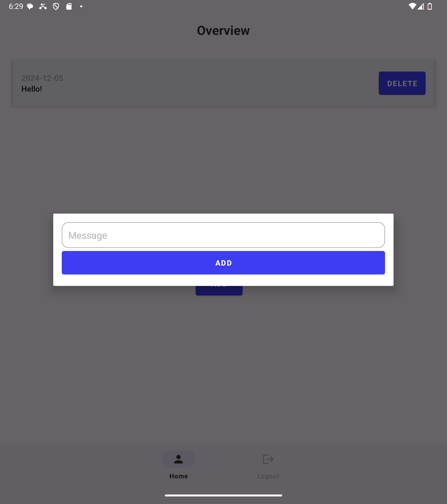
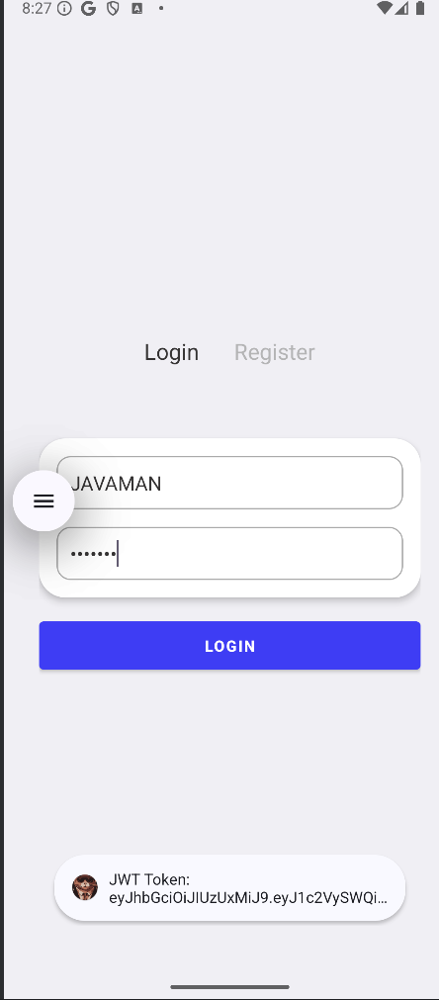
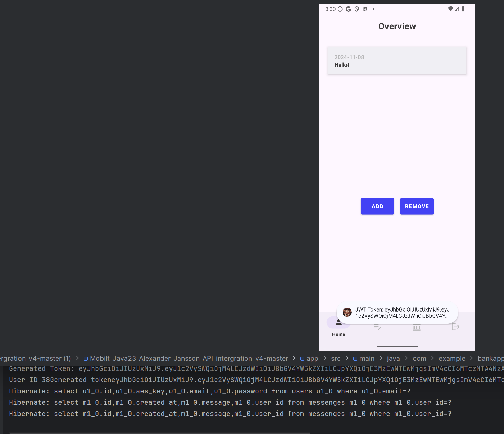
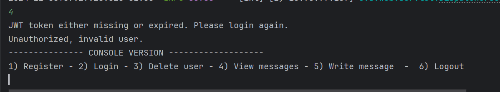
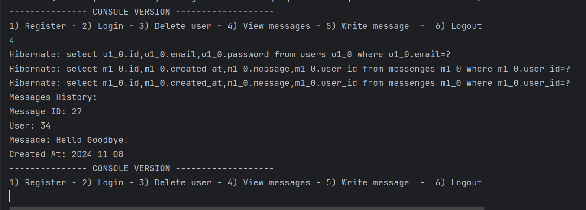

# TimeCapsule App – Frontend & Backend

---

## Repositories
<details>
  <summary><strong>Frontend Repository</strong></summary>
  
  [](https://github.com/AlexanderJson/frontend-client-timecapsule)

  ### Frontend README

  **Technologies**: Kotlin, Coroutines, LiveData, SharedPreferences, etc.

  **Description**: An app for writing notes and messages to yourself! Stored securily. 

  **Setup Instructions**:
  
  ****Backend REST api needed on local server for the app to work****
  
1. **Open any folder** on your local system.
2. In the address bar, type `cmd` and press **Enter** to open the command prompt.
3. **Clone the repository** using the following command:

   ```bash
   git clone https://github.com/AlexanderJson/frontend-client-timecapsule.git

 

# 🌌 TimeCapsule App – Frontend Repository

[](https://github.com/AlexanderJson/frontend-client-timecapsule)

---

## 🌐 Technologies

| **🛠 Component** | **🚀 Technology**        |
|------------------|-------------------------|
| **Frontend**     |       |

*📱 The frontend is built using **Kotlin** for Android*

---


## 🏗 Architecture & Structure


```markdown

- **API Network ➔ `api` class handles HTTP requests, sending them to the **repository** which processes the results.

- The **service class adds extra logic and operations to manage data effectively.

- ViewModels are used to manage the lifecycle of UI components, leveraging **Coroutines** and **LiveData** for asynchronous and reactive programming.

- Coroutines & LiveData: Utilized throughout the app to handle asynchronous operations efficiently.

- Secure Data Storage: Sensitive information, such as authentication tokens, is encrypted and securely stored in `SharedPreferences`.

- **Data Classes: Employed to handle and structure HTTP responses cleanly and effectively.

```


🎨 Design Elements

- **Color Palette**: Dark blue and white colors.
- **Animations**: User form rotates.

</details>

<details>
  <summary><strong>Backend Repository</strong></summary>
  
# Backend Repository – TimeCapsule App

[](https://github.com/AlexanderJson/IT_SAKERHET_JAVA23_Alexander_Jansson_Uppgift2)

---

## 🌐 Technologies

| **Component** | **Technology** |
|---------------|-----------------|
| **Backend**   |  |
| **Database**  |  |


## 🌐 Security


---

## 📥 Installation Instructions

To set up the backend server and connect it with the API and database, follow these steps:

1. **Open any folder** on your local system.
2. In the address bar, type `cmd` and press **Enter** to open the command prompt.
3. **Clone the repository** using the following command:

   ```bash
   git clone https://github.com/AlexanderJson/IT_SAKERHET_JAVA23_Alexander_Jansson_Uppgift2.git

## ✨ Features

## 🔐 Secure User Authentication


 ### 🧬 Password Encryption:
  
- **Bcrypt**: Uses **Bcrypt** to hash passwords.

 ### 🔑 Session Tokens
 - **JWT Tokens**: Are used to validate the users requests, to make sure only the right user can GET/POST their messages.

## 🔐 Secure Data encryption

### 💬 Encrypted Messages
- **AES Encryption**: Messages are encrypted before storage, ensuring only the owner can access them.

### 🔍 View Transactions
- **Encrypted Data Handling**: Only the authenticated user can fetch and decrypt their messages.

### 🗄 Encrypted Shared Preferences
- **Sensitive data are encrypted in shared preferences in Android using AES256_SIV and AES256_GCM encryption algoritms


</details>

---

## 📸 Gallery
<details>
  <summary><strong>View Key Screenshots</strong></summary>

  ### 📝 Add Message
  
  *The interface where users can add encrypted messages*

  ---

  ### 🔑 Login Screen
  
  *Login screen with user authentication using Bcrypt and JWT*

  ---

  ### 🔄 Alternate Home View
  
  *Homescreen with console in background to display how they work together*

  ---

  ### 🚫 Access Denied [Console]
  
  *Console output indicating unauthorized access when attempting to retrieve protected content*

  ---

  ### 💬 Alternate Add Transaction View [Console]
  
  *Another console view displaying how encrypted messages are fetched and handled securely*

</details>

---

> **Note**: Click the "View Key Screenshots" to see screenshots of both app and console!


> **Note**: Click on each section to view README info about both repositories!


