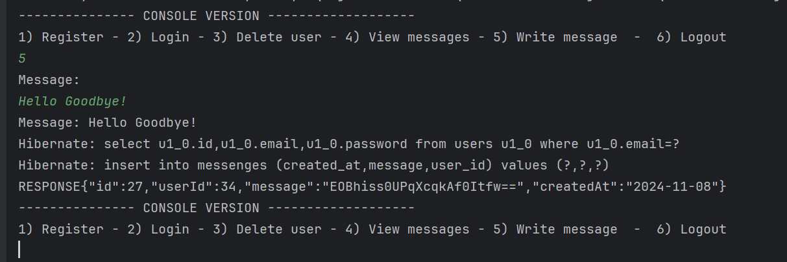

## Table of Contents

1. [Technologies](#technologies)
2. [Installation](#install-instructions)
3. [Features](#features)
4. [Architecture / Structure](#architecture--structure)
5. [Future Development](#future-development)
6. [Screenshots](#screenshots)


## Technologies
- **Android**: Kotlin
- **Backend**: Java Spring Boot
- **Database**: MySQL

## Install instructions
To use the app with the API and database, follow these steps:


1. Go to any folder.
2. In the address bar, type `cmd` and press **Enter**.
3. Clone the project:
   
```bash
git clone https://github.com/AlexanderJson/IT_SAKERHET_JAVA23_Alexander_Jansson_Uppgift2.git
```

```bash
git clone https://github.com/AlexanderJson/frontend-client-timecapsule.git
```


#### MySQL and local server needed. 


## Features
- **Register/Login**: Stores password with Bcrypt hashing and generates jwt tokens
  
- **Add messages**: Save messages to the database, encrypted with AES encryption. Only available on same user.
- **View transactions**: Fetches users AES key and decrypts messages upon retrival. Only available on same user.

- ***All data are encrypted in shared preferences in the app aswell***

## Frontend Architecture / Structure

## APP Logic: 
The app's structure is based on the following pattern:

- **API network** ➔ `api` class (HTTP requests) ➔ `repository` that returns HTTP results ➔ `service` class (additional logic) ➔ `viewmodels` for lifecycle management.
- Uses **Coroutines** and **LiveData** throughout.
- Secure data (like authentication tokens) is stored encrypted in `SharedPreferences`.
- **Data classes** are used to handle HTTP responses.

## Future Development
- **Delete transaction** (in progress).


## Screenshots

### Add Message
 


### Login Screen


### Home Screen


### Alternate Home View
.png)

### Access denied [console]


### Alternate Add Transaction View [console]


### Alternate Add Transaction View [console]


